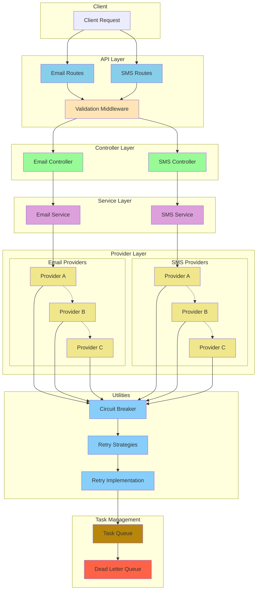

# mock notification service

## Architecture Design

Generated using [GitDiagram](https://gitdiagram.com/)



### Run Instructions

```bash
yarn dev
```

### Stress test with vegeta

```bash
vegeta attack -targets=sms-targets.txt -rate=10 -duration=1s | vegeta report
```
